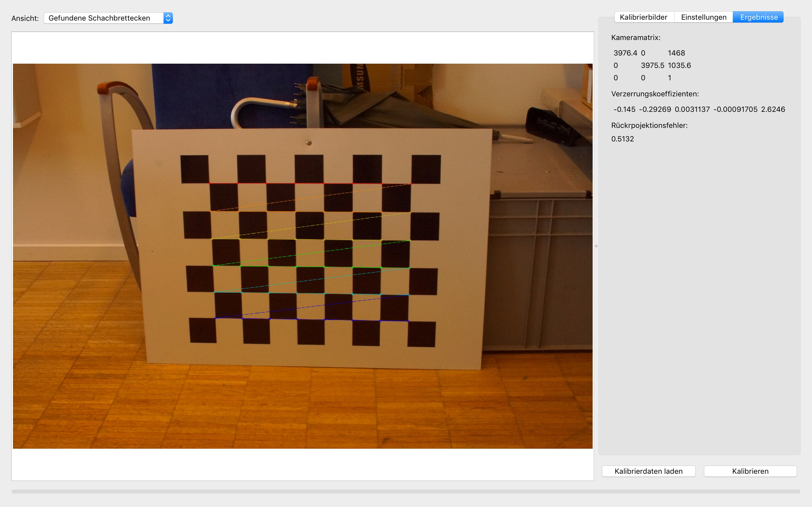

# Camera Calibration
A simple tool for calibrating a camera and analyzing reprojection errors based on OpenCV.




# Compilation 

## Mac OS 

Install dependencies:
```
brew install qt5 opencv
```

Build the tool:
```
mkdir build
cd build
cmake -DCMAKE_BUILD_TYPE=Release \
      -DQt5_DIR=$(brew --prefix qt5)/lib/cmake/Qt5 \
      ..
make -j
```
